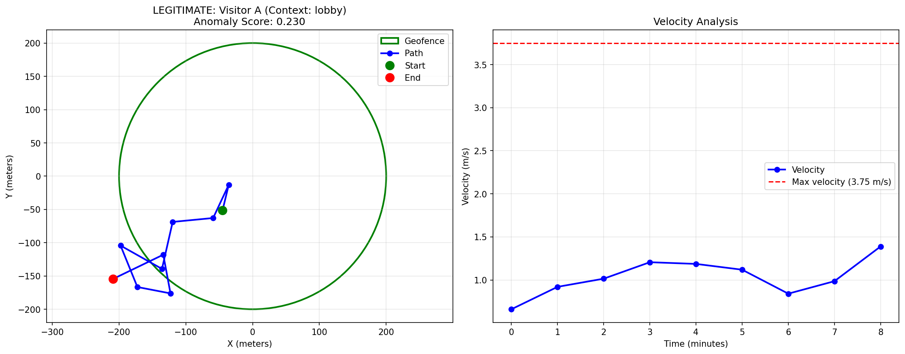
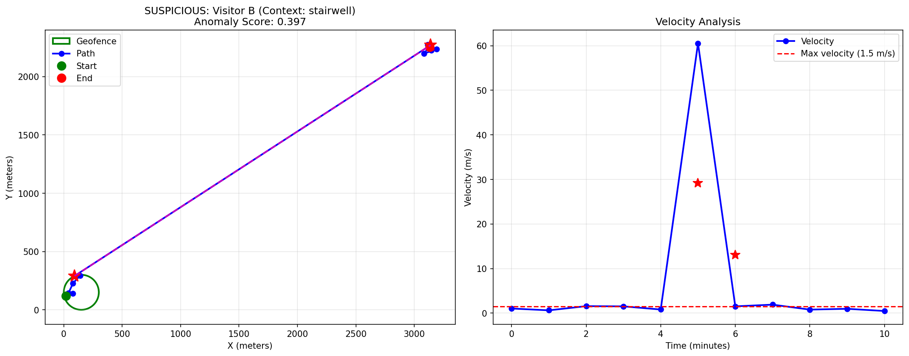

# Visitor Geofencing Security System

A production-grade, math-driven location verification system for visitor management. It detects GPS spoofing and physically implausible movement using Kalman filtering, logarithmic convergence, adaptive thresholds, per-visitor behaviour profiles, zone-aware rules, and badge/RFID correlation.

Originally developed and implemented as part of a real-world visitor management project. The core detection logic proved reliable in practice and is now released as open source (demo uses fully synthetic data).




## What it does

Visitors are tracked via GPS while moving through a facility. The system continuously evaluates whether their reported positions are *physically plausible*:

- Humans do not teleport
- Walking/running speeds stay within realistic bounds
- Acceleration is limited
- Reported GPS position should be consistent with badge/RFID reader locations

When a location report breaks these physical constraints (or disagrees with badge/RFID data), it is flagged as a possible spoofing attempt and given a risk score.

### Core capabilities

- **Kalman filtering (1D per axis)** – smooths noisy GPS readings before evaluation
- **Logarithmic convergence factor** – starts conservative and increases confidence as more data arrives
- **Adaptive thresholds** – automatically loosen or tighten based on GPS accuracy and observation history
- **Per-visitor behaviour profiles** – learn a visitor's typical velocity and acceleration across visits
- **Zone-aware rules** – different normal speed profiles for lobby, stairwell, parking, etc.
- **Badge / GPS correlation** – cross-checks RFID badge scans against GPS position
- **Risk scoring + audit logging** – ready for a security dashboard

## Repo layout

```
Geofencing-for-Visitor-Management-Systems/
├── geofencing/          # the package — detection engine
│   ├── __init__.py      # public API
│   ├── kalman.py        # Kalman filter + convergence factor + adaptive thresholds
│   ├── models.py        # dataclasses: Visitor, Position, ZoneProfile, etc.
│   ├── badge.py         # badge/RFID tracking and GPS correlation
│   ├── geofence.py      # GeofenceSystem — the core detection engine
│   ├── vms.py           # VisitorManagementSystem — day-to-day integration layer
│   └── synthetic.py     # synthetic GPS path generators for the demo
├── demo.py              # self-contained demo (produces the two images above)
├── Geofencing.py        # thin backwards-compatible entry point
├── assets/              # demo output images
├── requirements.txt
├── LICENSE
└── README.md
```

## Code structure

The detection engine is split into a small package, `geofencing/`, plus a demo script:

**`geofencing/kalman.py`** — signal processing
- `compute_log_convergence_factor()` — the `c(n)` function
- `KalmanFilter1D` — smooths one coordinate axis per instance; two are used together for (x, y)
- `get_adaptive_thresholds()` — the `τ(c)` threshold scaling

**`geofencing/models.py`** — data models (plain dataclasses)
- `Visitor`, `Position`, `VisitorLocationReport`, `DetectionResult`
- `ZoneProfile` — per-zone speed/acceleration limits (lobby vs. stairwell vs. parking, etc.)
- `UserBehaviorProfile` — a visitor's learned typical velocity/acceleration, refined over repeat visits
- `BuildingLayout` — holds a facility's zones and visitor profiles together

**`geofencing/badge.py`** — badge/RFID tracking
- `BadgeEvent`, `BadgeGPSCorrelation` — badge scan data and its comparison against GPS
- `BadgeSystem` — registers RFID readers and cross-checks scans against reported GPS via `correlate_badge_gps()`

**`geofencing/geofence.py`** — detection engine
- `GeofenceSystem` — the core class for one zone. `detect_spoofing()` runs Kalman smoothing, computes velocity/acceleration violations, geofence-boundary time, and teleportation jumps, then returns a weighted `DetectionResult`. `verify_visitor()` wraps this per-visitor and folds in behavior-profile adjustments.

**`geofencing/vms.py`** — integration layer
- `VisitorManagementSystem` — the class you actually use day-to-day: `register_visitor()`, `add_geofence()`, `verify_visitor_location()`, `record_badge_event()`, `export_audit_log()`. It owns all active visitors, zones, and the running security-alert log.

**`geofencing/synthetic.py`** — demo data
- `generate_legitimate_path()`, `generate_spoofed_path()`, `generate_extreme_spoofed_path()` — build synthetic GPS traces for testing

**`demo.py`** — the runnable walkthrough that builds a sample facility, runs several visitor scenarios, and saves the two images above into `assets/`. `Geofencing.py` at the repo root just calls into this, kept so `python Geofencing.py` still works exactly as before.

### Minimal usage

```python
from geofencing import VisitorManagementSystem, Visitor, Position
from datetime import datetime

vms = VisitorManagementSystem()
vms.add_geofence("main_lobby", center=(0.0, 0.0), radius=200.0)

visitor = Visitor(
    visitor_id="V001", name="Jane Doe", badge_tag="B-001",
    entry_time=datetime.now(), expected_zones=[(0.0, 0.0)],
    allowed_areas=["main_lobby"],
)
vms.register_visitor(visitor)

positions = [
    Position(t=0.0, x=0.0, y=0.0, gps_accuracy=5.0),
    Position(t=60.0, x=1.5, y=0.5, gps_accuracy=5.0),
]
report = vms.verify_visitor_location("V001", "main_lobby", positions)
print(report.risk_level, report.anomaly_score)
```

## The math (and why each piece is there)

Every part of the detection logic exists to solve a specific, concrete problem — not for its own sake. Here's why each one is in the code:

**GPS readings are noisy → Kalman filter (1D)**
Consumer GPS jitters by a few meters even when someone is standing still. Feeding raw coordinates straight into anomaly checks would trigger false alarms constantly. The Kalman filter predicts where the visitor *should* be next based on their last known position, then blends that prediction with the new noisy reading — weighted by how much it trusts each one. The result is a smoothed position that's far more stable than either the prediction or the raw reading alone.

**New visitors have no track record → logarithmic convergence factor**
The very first GPS ping from a brand-new visitor tells you almost nothing — is 3 m/s their walking speed or a glitch? The system shouldn't be fully confident on one data point, but it also shouldn't wait forever to trust anything. `c(n) = min(1, ln(n + 1) / ln(B + 1))` grows quickly at first and then levels off — so confidence builds fast early on and then plateaus, rather than needing hundreds of readings to become useful.

**Fixed limits punish legitimate variation → adaptive thresholds**
A single hard speed limit is either too strict for a new visitor (lots of false positives before the system has learned anything) or too loose once you'd otherwise have enough history to be stricter. `τ(c) = 0.5 + 1.0 · c` ties the tolerance directly to the convergence factor above: loose at first, tightening automatically as the system accumulates evidence.

**One violation isn't proof of spoofing → weighted anomaly scoring**
A visitor could trip one check for an innocent reason (dropped signal, elevator, etc.). Spoofing is more convincingly signaled by *multiple* things going wrong together — speed, acceleration, time outside the geofence, and sudden jumps are combined into a single weighted score, and that score maps to a risk level (`TRUSTED` → `CRITICAL`) rather than a binary flag.

For reference, this maps onto IB Mathematics AA HL as follows: logarithmic functions and transformations (the convergence factor), sequences and limits (`c(n)` as `n → ∞`), vectors and vector geometry (position/displacement/geofence checks), statistics — mean and variance (the Kalman filter's noise model), and functions and transformations (`τ(c)`). That background isn't required to follow the explanations above — it's just where the ideas originally came from.

## Running the demo

```bash
pip install -r requirements.txt
python Geofencing.py
```

The script runs a self-contained demonstration with synthetic visitors and simulated GPS paths, and writes the two images shown above to `assets/`. No real location data is required or included.

## Requirements

- Python 3.9+
- numpy >= 1.24
- matplotlib >= 3.7

## Status

This repository contains the detection engine that was implemented and validated in a live visitor-management context. The public demo uses completely synthetic names, zones, and trajectories. The mathematical approach (Kalman filtering + logarithmic convergence + adaptive thresholds) proved reliable and forms the foundation of this open-source release.

## License

MIT — see [LICENSE](LICENSE).
