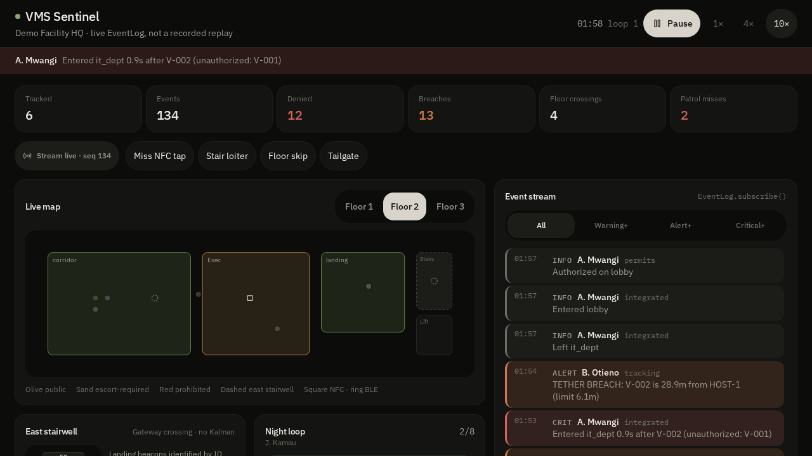

# Geofencing for Visitor Management System

A production-grade, **math-driven** location verification system for visitor management.
It detects GPS spoofing and physically implausible movement using Kalman filtering, logarithmic convergence, adaptive thresholds, per-visitor behaviour profiles, zone-aware rules, and badge/RFID correlation.

I originally developed and implemented this as part of a real-world visitor management project over the course of a year. The core detection logic proved reliable in practice and is now released as open source (demo uses fully synthetic data).


## What it does

Visitors are tracked via **visitor tags** (not personal phones) while moving through a facility.
The system continuously evaluates whether their reported positions are *physically plausible*:

- Humans do not teleport
- Walking/running speeds stay within realistic bounds
- Acceleration is limited
- Reported GPS position should be consistent with badge/RFID reader locations

When a location report breaks these physical constraints (or disagrees with badge/RFID data), it is flagged as a possible spoofing attempt and given a risk score.

### Core capabilities

- **2-D constant-velocity Kalman filter** – smooths noisy GPS and derives velocity & acceleration directly from the filter state
- **Logarithmic convergence factor** – starts conservative and increases confidence as more data arrives
- **Uncertainty-aware adaptive thresholds** – automatically loosen or tighten based on GPS accuracy, observation history *and* the filter's own position uncertainty
- **Robust per-visitor behaviour profiles** – median + MAD with exponential forgetting (only trusted observations shrink the MAD)
- **Polygonal zones + directed transition graph** – supports complex floor plans and forbidden zone-to-zone jumps
- **Badge / GPS risk fusion** – RFID mismatch is no longer a parallel signal; it is a first-class term inside the main anomaly score
- **Risk scoring + audit logging** – ready for a security dashboard

---

## The math (and why each piece is there)

Every part of the detection logic exists to solve a specific, concrete problem — not for its own sake.

**GPS readings are noisy → 2-D constant-velocity Kalman**
Consumer GPS (and even industrial tags) jitter by several metres.
State vector \(\mathbf{x} = [p_x, p_y, v_x, v_y]^\top\).
Velocity is taken from the filter state; acceleration is obtained by finite difference of successive velocity estimates.
This replaces the earlier 1-D-per-axis approach and gives cleaner kinematic signals.

**New visitors have no track record → logarithmic convergence factor**
\[
c(n) = \min\bigl(1,\ \tfrac{\ln(n+1)}{\ln(B+1)}\bigr)
\]
Grows quickly at first, then asymptotes. Applied both to the Kalman gain (with a floor so early measurements are never completely ignored) and to the adaptive thresholds.

**Fixed limits punish legitimate variation → adaptive thresholds**
\[
\tau(c) = 0.5 + c
\]
Further inflated by the filter's own position uncertainty \(\sigma\):
\[
\tau(c,\sigma) = \tau(c)\cdot\bigl(1 + \max(0,(\sigma-5)/20)\bigr)
\]
Loose at the start, tighter once the system has evidence, and automatically more tolerant when the filter itself is uncertain.

**One violation isn't proof of spoofing → weighted, uncertainty-aware anomaly score**
Velocity, acceleration, path efficiency, geofence dwell, boundary jumps, **badge risk** and **forbidden transitions** are combined into a single score.
When filter uncertainty is high, kinematic weights are down-scaled and badge weight is increased. The weights are re-normalised so the total remains 1.

**Behaviour profiles must not be poisoned by a single spoofed visit → robust statistics**
Online median + MAD with exponential forgetting \(\lambda\).
Only observations that the system itself judged TRUSTED/LOW are allowed to shrink the MAD. Untrusted data can only raise the soft ceiling (safety).

**Complex buildings need more than circles → polygons + transition graph**
Point-in-polygon by ray casting (even-odd rule).
Directed graph of allowed zone-to-zone movements with optional maximum transit times.

**Why the approach is mathematical in the first place:** I studied IB
Mathematics Analysis and Approaches at Higher Level, and that training is
the foundation this whole system is built on rather than a label applied
to it afterwards. Reaching for a Kalman filter instead of a moving
average, a logarithmic convergence factor instead of a fixed warm-up
count, median/MAD instead of mean/standard deviation, and the dot product
to answer "is this person walking *at* that door" — those are AA HL tools,
chosen because the syllabus makes clear what each one actually buys you.
The specific topics in play here: logarithmic functions and
transformations (the convergence factor), sequences and limits (\(c(n)\)
as \(n\to\infty\)), vectors and vector geometry
(position/displacement/geofence/polygon checks), statistics — mean,
variance, median, MAD (Kalman noise model and robust profiles), and
functions and transformations (\(\tau(c,\sigma)\)).

---

## What's new in this release (the upgrades)

| Upgrade | What changed | Why it matters for live VMS |
|---------|--------------|-----------------------------|
| 2-D constant-velocity Kalman | Velocity & acceleration now come from the filter state instead of raw finite differences | Cleaner signals on 15–60 s tag reporting intervals |
| Uncertainty-aware scoring | Filter covariance \(\sigma\) influences both thresholds and component weights | Reduces false alarms when GPS is noisy |
| Polygonal zones + transition graph | Full polygon support + forbidden zone jumps | Handles real floor plans (multi-building sites) |
| Robust behaviour profiles | Median/MAD + exponential forgetting; trusted-only updates | A single spoofed visit can no longer poison a visitor's profile |
| Badge risk fusion | RFID mismatch is a weighted term inside the main anomaly score | One coherent risk number for the security dashboard |

These upgrades directly address the live-testing challenges of coordinate drift near boundaries, large reporting intervals, complex layouts, and alert fatigue — while preserving the original transparent, tag-based mathematical philosophy.

---

## v2 roadmap: zone mapping, positioning, and real-time policy enforcement

Eight modules building toward a fuller production system: dynamic floor
plans, indoor positioning, real-time policy enforcement, incident
response, tag lifecycle management, elevator/vertical tracking, and
time-windowed authorization.

- **`floorplan.py`** — blueprint-to-real-world coordinate calibration via
  a complex-number similarity transform, and a `ZoneHierarchy` that
  resolves overlapping/nested zones by area. Its 3D containment and area
  logic live directly on the real `ZoneProfile` class in `models.py`
  (`contains_3d()`, `area()`, `floor_id`/`z_min`/`z_max`/`risk_level`)
  rather than a separate parallel type.
- **`multilateration.py`** — anchor-based (x, y, z) positioning from
  ranging data: log-distance RSSI conversion, linear multilateration
  refined by Gauss-Newton least squares. Note: vertical accuracy is
  materially weaker than horizontal with ceiling-mounted anchors (see
  module docstring for why, and the per-floor-anchor-network mitigation).
- **`tracking.py`** — escort tethering (confidence-aware distance
  threshold), dwell time anomaly detection (z-score against a per-zone
  baseline), directional-vector intent detection (dot-product angle
  toward a target), and `ZoneLockTracker` — debounced zone entry/exit
  (a candidate zone must be observed 3 consecutive times before the
  lock changes), preventing boundary ping-pong the same way
  `elevator_tracking.py`'s `BeaconLockTracker` does for floor identity.
- **`incident.py`** — automated mustering with staleness-decayed position
  confidence, nearest-guard proximity dispatch, and `PresenceTracker` —
  active TTL/heartbeat exit detection for tags that go silent.
- **`tag_lifecycle.py`** — tag provisioning, battery discharge-rate
  prediction (linear regression), anti-passback / tag-drop detection
  (speed-anomaly + rolling-variance stationary detection), and
  `ReliabilityWarmup` — suppresses alerts on a freshly-reconnected tag's
  first few readings (same start-conservative principle as `kalman.py`'s
  logarithmic convergence factor), since burst noise on wake is a real,
  proven false-positive source.
- **`integrated.py`** — wires the four modules above into
  `VisitorManagementSystem`: a single `update_visitor_position()` entry
  point runs spoofing detection, tether/dwell/tag-drop checks, and zone
  resolution together for one incoming position update.
  Two compound event types close a real gap for the CCTV integration:
  `loitering_unauthorized` fires one signal (not two independent ones)
  when someone dwells too long in a zone they were never authorized to
  enter, and `tailgating` detects a second, unauthorized visitor
  confirming entry within 5s of an authorized one at the same gateway.
- **`elevator_tracking.py`** — 1D vertical position tracking for an
  elevator car, fusing car-mounted accelerometer readings (control input
  to a kinematic Kalman filter) with shaft-beacon floor-crossing events
  (measurement corrections). Beacons are identified by ID via
  `BeaconRegistry`, not inferred from an assumed crossing sequence —
  earlier version of this module assumed sequential order, which a
  missed detection could throw off by meters; fixed and verified against
  that exact failure case.
- **`permits.py`** — time-windowed zone/floor authorization
  (`Permit`/`PermitRegistry`): the "schedules and permits" requirement
  named in the architecture but missing from `Visitor.allowed_areas`,
  which says *which* zones but never *when*. Deliberately built as one
  general model — works for any `zone_id`, whether that's a
  `ZoneProfile.zone_name` or an elevator `FloorBeacon.floor_id` — rather
  than a zone-flavoured version and a separate floor-flavoured one. Now
  wired into the live path: `check_in_visitor()` turns a guest's stated
  destination plus tag type (standard vs escorted) into real
  time-windowed permits, and escort presence is verified against live
  proximity rather than assumed, so an escorted tag's rights lapse the
  moment the host walks away. Privilege is bound to the physical tag in
  `TagRegistry` (which also carries the guest's name, so operators read
  "A. Mwangi", not "TAG-0042"), not passed as an argument — a standard
  tag cannot be upgraded by re-checking in, and a guest cannot hold two
  live tags at once.

The same AA HL foundation carries through the v2 modules: complex numbers (blueprint calibration),
vectors (distance/containment/directional checks), sequences and series
(shoelace formula), statistics (z-score anomaly thresholds, variance),
systems of linear equations (multilateration), and calculus (double
integration of measured acceleration in the elevator Kalman filter).

### Field validation status

Beacon hardware for this project has been tested on-site at an active
real-world multi-story facility — confirmed broadcasting and detectable
throughout the building, including inside elevator shafts, and the core
VMS detection pipeline processed that real on-site data successfully.

`elevator_tracking.py` has since had its first on-site test against real
hardware, and that test surfaced real issues no amount of simulation
would have caught — exactly the kind of thing field testing is *for*.
Two led to concrete fixes:

- **Beacon-identity ping-ponging near floor boundaries.** Real RSSI
  noise near the midpoint between two floors made naive
  "whichever beacon looks closest right now" logic flip identity
  repeatedly on noise alone. Fixed with `BeaconLockTracker`: an
  exponential moving average smooths each candidate beacon's readings,
  and a hysteresis margin means a challenger has to be *robustly*
  closer, not just marginally closer on one noisy sample, before the
  locked identity changes. Verified against the exact failure case: 16
  identity flips over 40 readings with naive logic, 0 with the fix — and
  confirmed the fix still switches correctly when the car genuinely
  moves from one floor to the next, not just permanently frozen (see
  module `__main__`).
- **Missed exit events.** `muster()`/`position_confidence()` above are
  passive — a stale position just gets flagged, and only when a report
  happens to be requested. On-site testing found tags that go silent
  (dropped signal, badge handed back without checkout) need an *active*
  exit event, not a flag waiting to be noticed. Added `PresenceTracker`
  to `incident.py`: a TTL/heartbeat model that fires an exit event on
  its own once an entity's been silent past the configured threshold
  (default 4 minutes), fires it exactly once rather than repeating on
  every subsequent check, and correctly un-exits someone if a heartbeat
  arrives late.

Two other issues surfaced by the same test aren't code fixes:

- **OS background sleep** killing the scanning app on the phone/device
  side — an app-permissions and battery-optimization deployment
  requirement, not something to patch in this codebase.
- **Signal reflection/blockage** in parts of the facility — the
  documented mitigation (more overlapping beacons, multi-mode
  positioning combining BLE with Wi-Fi/GPS) is a deployment-topology and
  hardware decision. Worth noting `multilateration.py`'s weighted
  least-squares solver already generalizes to fusing multiple ranging
  sources with different uncertainty, so multi-mode positioning is
  architecturally supported if pursued later — it just hasn't been,
  since there's no real multi-mode data yet to validate it against.

Everything else in this section (`event_log.py`) is validated through
simulation only, not yet live hardware.

`floorplan.py`, `multilateration.py`, `tracking.py`, `tag_lifecycle.py`,
and `permits.py` have since had their own first on-site test, across
multiple buildings. Three real issues found led to concrete fixes,
using the exact same patterns proven above rather than inventing new
ones:

- **Zone-boundary ping-ponging** — the same failure mode as the beacon
  one above, this time for zone entry/exit. Caught a live instance of
  it in this project's own code: `integrated.py`'s zone transition
  logging had no debounce at all until this testing found it. Fixed
  with `ZoneLockTracker` (`tracking.py`) — a candidate zone must be
  observed 3 consecutive times before the lock changes. Verified: 24
  raw flips down to 3 over 50 readings under aggressive boundary
  jitter, while a real sustained transition still confirms correctly.
- **Stale/zombie tags** — `PresenceTracker` already existed, tested
  standalone, but was never actually wired into the position-update
  pipeline. Fixed by connecting it; every position update is now a
  heartbeat.
- **Burst noise on tag reconnection** — a freshly-reconnected tag's
  first few readings are often erratic. Fixed with `ReliabilityWarmup`
  (`tag_lifecycle.py`), the same start-conservative-earn-confidence
  principle `kalman.py`'s logarithmic convergence factor already uses
  elsewhere in this project, reapplied here as alert suppression.
  Verified end-to-end: a real tether breach present from the first
  reading is correctly suppressed for 3 readings, then fires normally —
  logged as suppressed, not silently dropped.

Real issues still open from this round, not yet fixed: coordinate
calibration accuracy under real blueprint distortion, multipath-induced
position spikes, dilution-of-precision in narrow anchor corridors, and
smoothing-filter lag on high-risk zone breaches. Full detail, including
one flagged concern (non-convex polygon containment) that was tested
directly and found to already work correctly, is in
[`TESTING.md`](TESTING.md).

This section gets updated as on-site results come in, not claimed
ahead of them.

### Live operations dashboard

`live_event_dashboard.html` is an end-to-end replay of a real run of
`geofencing/integrated.py` — two visitors (one standard tag, one
escorted) plus a staff escort moving through three zones of increasing
risk, producing 33 genuine events across all four severity levels. It
shows how the system actually runs, not a mock-up:

- **Live map** — zones shaded by `risk_level`, units drawn at their real
  tracked positions, labelled with guest names resolved through
  `TagRegistry`.
- **Route history playback** — scrub or play the whole visit back;
  movement trails accumulate behind each unit, which is the view you'd
  want for an incident review or audit.
- **Breach alerts** — the most recent CRITICAL event surfaces as a
  standing banner, with live counters for denied entries and breaches.
- **Boundary creation tools** — draw circular, rectangular or custom
  polygon boundaries over the map for planning. These are local scratch
  geometry only; they are not written back to any `ZoneProfile`.
- **Severity filtering** — the same `min_severity` filter `EventLog.query()`
  supports, so you can drop to Alert+ or Critical-only.

None of its contents are hand-written: the positions, messages and
severities are exactly what the pipeline emitted. It is still a static
replay — it does not call into Python live — but it renders precisely
the shape `Event.to_dict()` produces, so wiring it to a real
`EventLog.subscribe()` feed is a transport change, not a rewrite.

### Live dashboard simulation

`live_dashboard_simulation.html` is a self-contained, dependency-free
walkthrough of the scenario above: an escorted visitor moves through a
two-floor facility, and the dashboard shows 3D zone containment (the
same x/y position resolving to different zones on different floors), an
escort-tether breach, a dwell-time anomaly, a tag-drop detection, an
automated muster count, and a proximity-dispatch result — one coherent
story instead of five separate modules.

It exists to make the v2 work easy to *see* working end to end without
reading through five files of Python first — useful for demos, and as a
regression check that a future change to the underlying logic still
tells the same coherent story.

**Important:** it's a static, pre-scripted replay of a validated test
run, not a live wrapper around `integrated.py`. The numbers are real —
they're the actual output of running the scenario against
`geofencing/integrated.py` — but the HTML doesn't call into the Python
code, so if the underlying logic changes later, this file won't
automatically reflect that on its own. Open it directly in a browser;
no server or build step needed.

### VMS Sentinel dashboard (`dashboard/`) — a live, interactive version

The two dashboards above are static, pre-scripted replays of a captured
run. `dashboard/` takes the same idea and makes it live: a real,
in-browser TanStack Start/React app that runs a scripted simulation in
real time rather than replaying a fixed event log. It is not a wrapper
around `geofencing/integrated.py` — it's an independent implementation
exploring the same underlying question (is this visitor's reported
location physically plausible, and does it match what other signals
say?) from an indoor BLE/NFC angle instead of GPS/Kalman: beacon-based
floor-lock for stairwells, debounced zone-entry detection, mandatory
NFC-tap patrol checkpoints (BLE proximity alone can never satisfy one),
tailgating detection, and host-tether breaches — all driven by a
scripted simulation (`dashboard/src/lib/vms/simulation.ts`), not real
sensor data.



Why it exists: the facility this project is based on already runs a
security-ops dashboard showing geofencing activity in real time, so it
made sense to have a live version of that living in this repo alongside
the two static replays, rather than a scripted HTML file being the only
thing anyone outside the deployment ever sees move.

Detection modules (`dashboard/src/lib/vms/`):

- **`beacon.ts` / `stairwell.ts`** — EMA-smoothed, hysteresis-locked
  floor detection, the same ping-pong-resistant pattern as
  `elevator_tracking.py`'s `BeaconLockTracker` above, applied to
  stairwell floor crossings instead of an elevator shaft.
- **`zone-lock.ts`** — requires several consecutive readings before
  confirming a zone change, the same debounce principle as
  `tracking.py`'s `ZoneLockTracker`.
- **`patrol.ts`** — BLE range for general checkpoints, a mandatory NFC
  tap for high-integrity checkpoints, plus sequence and min/max
  transit-time checks between checkpoints.
- **`event-log.ts`** — severity computed from event type + zone risk
  level, not hardcoded per event.
- **`simulation.ts`** — ties it together: zone entry/exit + permit
  checks, tailgating detection, host-tether breach detection, and
  dwell/loitering anomalies in prohibited zones.

Running it:

```bash
cd dashboard
npm install
npm run dev
```

Then open the printed local URL. Use the speed controls (1× / 4× / 10×)
to run the demo loop faster, and the inject buttons (miss NFC tap, stair
loiter, floor skip, tailgate) to force specific anomaly scenarios on
demand.

Tests: `dashboard/src/lib/vms/prove.ts` runs a handful of boot-time
self-checks the moment the simulation starts — severity scoring escalates
correctly by risk level, the beacon-lock tracker stays stable where a
naive approach would ping-pong, a stairwell climb produces a
floor-crossing event, and standing in BLE range of an NFC checkpoint can
never verify it. `npm test` also runs a broader suite inherited from the
app-builder template this was scaffolded with, covering build tooling and
an auth system that's disabled and unused here — not the detection logic
itself. Beyond `prove.ts`, the detection modules don't yet have a
conventional unit-test suite; that's the natural next addition if this
dashboard moves beyond a demo.

---

## Repo layout

```
Geofencing-for-Visitor-Management-Systems/
├── geofencing/              # the package — detection engine
│   ├── __init__.py          # public API
│   ├── kalman.py            # 2-D CV Kalman + c(n) + τ(c,σ)
│   ├── models.py            # dataclasses, ZoneProfile (2D + 3D), robust profiles, transition graph
│   ├── badge.py             # badge/RFID tracking and GPS correlation
│   ├── geofence.py          # GeofenceSystem — the core detection engine
│   ├── vms.py               # VisitorManagementSystem — day-to-day integration layer
│   ├── synthetic.py         # synthetic GPS path generators for the demo
│   ├── floorplan.py         # blueprint calibration + zone hierarchy (built on ZoneProfile)
│   ├── multilateration.py   # anchor-based (x, y, z) positioning
│   ├── tracking.py          # escort tethering, dwell monitoring, directional vectors
│   ├── incident.py          # mustering + proximity dispatch
│   ├── tag_lifecycle.py     # provisioning, battery health, anti-passback/tag-drop
│   ├── integrated.py        # wires the v2 modules into VisitorManagementSystem
│   ├── elevator_tracking.py # 1D Kalman vertical tracking, accelerometer + beacon fusion
│   └── permits.py           # time-windowed zone/floor authorization
├── demo.py                  # self-contained demo (produces the two images above)
├── Geofencing.py             # thin backwards-compatible entry point
├── live_event_dashboard.html       # live map, playback, breach alerts, boundary drawing tools
├── live_dashboard_simulation.html  # static walkthrough of the v2 scenario end to end
├── dashboard/                # VMS Sentinel — live, interactive React/TypeScript version
│   └── src/lib/vms/          # beacon floor-lock, zone debounce, patrol NFC/BLE verification,
│                              # severity-scored event log, simulation engine (see above)
├── assets/                  # demo output images
├── screenshots/             # VMS Sentinel dashboard screenshots
├── requirements.txt
├── LICENSE
└── README.md
```

## Minimal usage

```python
from geofencing import (
    VisitorManagementSystem, Visitor, Position,
    ZoneProfile, TransitionGraph, BuildingLayout
)
from datetime import datetime

lobby = ZoneProfile(
    zone_name="main_lobby",
    center=(0, 0),
    radius=80,
    vertices=[(-60, -40), (60, -40), (70, 50), (-50, 55)],  # polygonal
    v_max=2.2, a_max=1.8, zone_type="lobby"
)

tg = TransitionGraph()
tg.add_edge("parking", "main_lobby", max_time=180)

layout = BuildingLayout("Demo Facility HQ", zones=[lobby], transition_graph=tg)

vms = VisitorManagementSystem()
vms.set_building_layout(layout)

visitor = Visitor(
    visitor_id="V001", name="Jane Doe", badge_tag="B-001",
    entry_time=datetime.now(), allowed_areas=["main_lobby"]
)
vms.register_visitor(visitor)

positions = [
    Position(t=0.0,  x=0.0,  y=0.0, gps_accuracy=4.5),
    Position(t=45.0, x=12.0, y=3.0, gps_accuracy=5.0),
    Position(t=90.0, x=25.0, y=8.0, gps_accuracy=4.8),
]
report = vms.verify_visitor_location("V001", "main_lobby", positions)
print(report.risk_level, report.anomaly_score, report.position_uncertainty)
```

## Running the demo

```bash
pip install -r requirements.txt
python Geofencing.py
```

The script runs a self-contained demonstration with synthetic visitors and simulated GPS paths, and writes the two images shown above to `assets/`. No real location data is required or included.

## Requirements

- Python 3.9+
- numpy ≥ 1.24
- matplotlib ≥ 3.7

## Status

This repository contains the detection engine that was implemented and validated in a live visitor-management context. The public demo uses completely synthetic names, zones, and trajectories. The mathematical approach (2-D constant-velocity Kalman + logarithmic convergence + uncertainty-aware adaptive thresholds + robust profiles) proved reliable and forms the foundation of this open-source release.

The `dashboard/` app is a separate, self-contained demo/prototype exploring
a parallel, indoor detection surface. All names, zones, and locations in it
are synthetic, same as the rest of this repo.

## License

MIT — see LICENSE.
